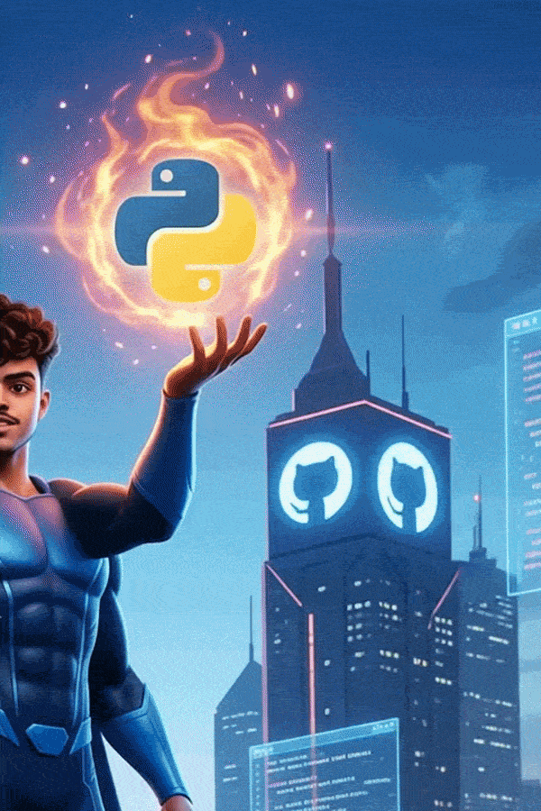

  

   
  
  

    
  

  

    
    
    
  

---

### 🔥 The Elevator Pitch
> **Mechanical Engineering mind. Software Engineering execution.** > I am an engineering student (Mech'28) and full-stack developer who builds scalable applications and AI-driven solutions. From maintaining a **180+ day active coding streak** to earning my **AWS Educate Generative AI certification**, I am obsessed with continuous growth, open-source collaboration, and solving real-world problems. 

 

### 🏆 The Trophy Room: Projects & Hackathons

<table width="100%" align="center">
  <tr>
    <td width="50%" valign="top">
      <h4>🌬️ AI-Driven Micro Fan Pods</h4>
      <i>🥉 3rd Place - National Level Hackathon (AIET)</i> 
      Built an ML-based cooling control system designed to efficiently detect and reduce hotspot temperatures in data centers and high-heat environments.
    </td>
    <td width="50%" valign="top">
      <h4>🌾 eSanthe (Smart Agriculture)</h4>
      <i>🌟 National Hackathon Shortlist</i> 
      Developed a platform to digitalize traditional rural markets (Santhe), bringing modern technology and accessibility to rural farming communities.
    </td>
  </tr>
  <tr>
    <td width="50%" valign="top">
      <h4>🎮 Music Asteroids & The Island</h4>
      <i>🚀 C++ & C# Game Development</i> 
      Engineered interactive game systems focusing on Object-Oriented Programming (OOP), memory management, and complex gameplay logic building.
    </td>
    <td width="50%" valign="top">
      <h4>✍️ Digital Platforms</h4>
      <i>🌐 Content & News Hubs</i> 
      Architected and manage <b>GrowthDiary</b> and the <b>OmniCognito</b> news hub, driving digital content and engagement.
    </td>
  </tr>
</table>

 

### ⚙️ Tech Arsenal

  

 

### 📈 Global Impact & Analytics

  
  

 

  <i>"Don't prepare for interviews. Prepare to become the engineer companies want to hire."</i> 
  <b>Ask me about: Tech Architectures, Prompt Engineering, or the latest RCB & CSK match
